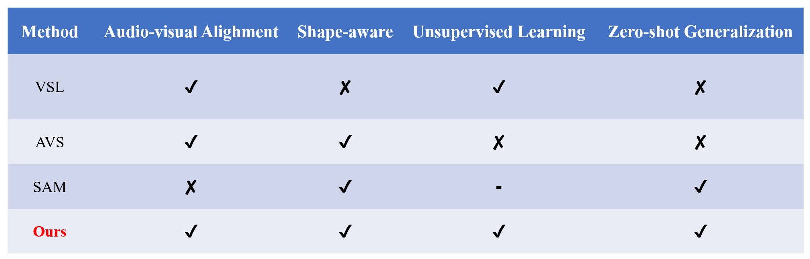
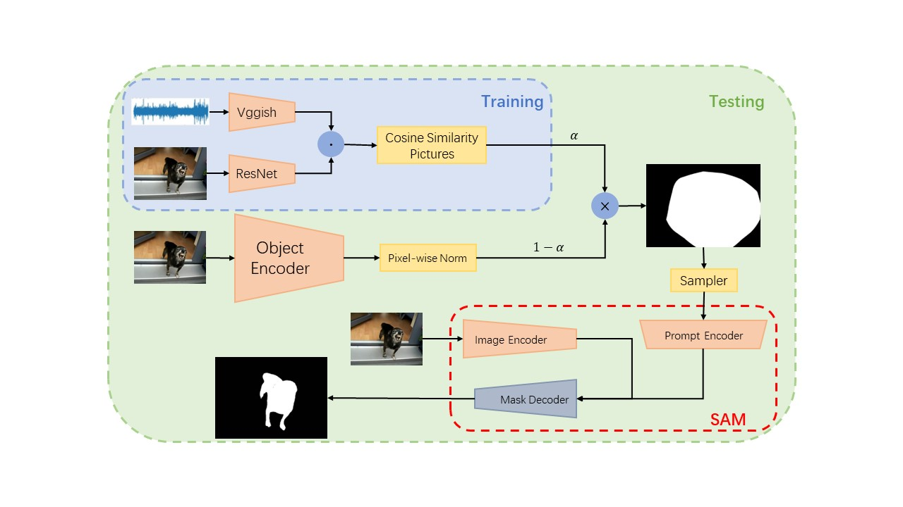

# ?When Segment Anything Model Meet Sound Source Localization.
2023年秋季学期，[刘静](https://people.ucas.ac.cn/~liujing)老师的《多媒体信息处理》大作业，课程最终得分95。

我们将SAM应用到声源定位任务，在无监督的任务设置下，实现具有强大零样本泛化能力、且具有分割粒度的声源定位模型，进一步探索 SAM 在视听学习领域的潜力。
为此，我们小组提出了 **Generalizable Shape-aware Audio-Visual Localization(GSAVL)**模型，在无监督设置下实现了像素级声源定位预测，在声源分割数据集 AVSBench 上效果远超传统的声源定位方法。

## ?Methods

